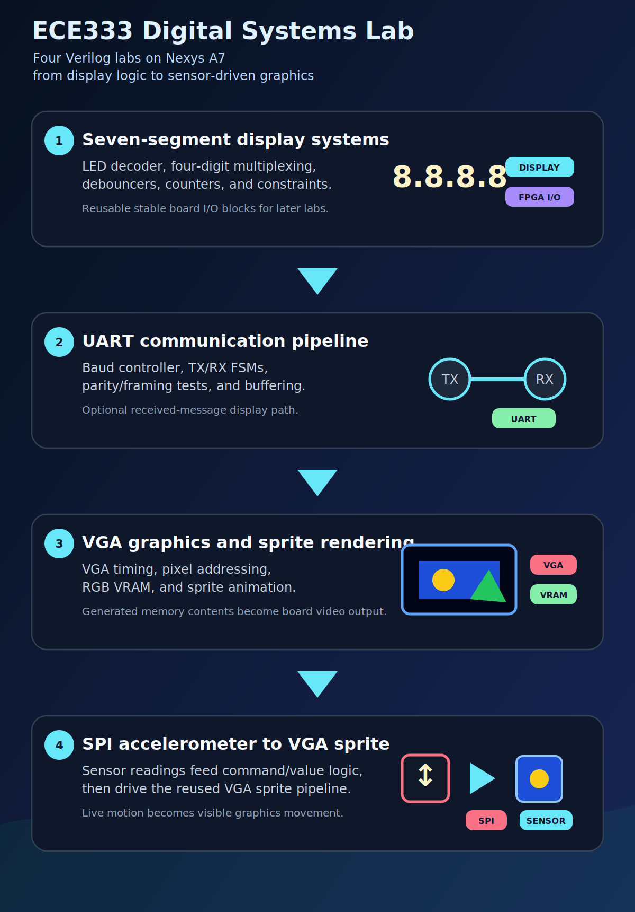
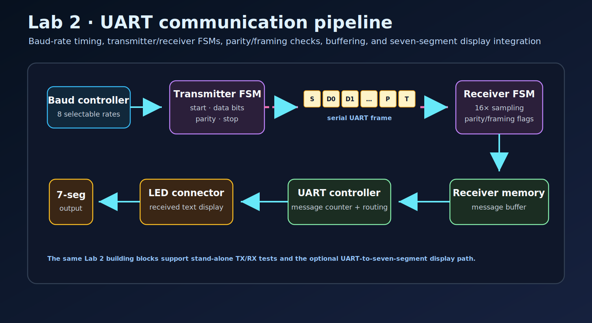
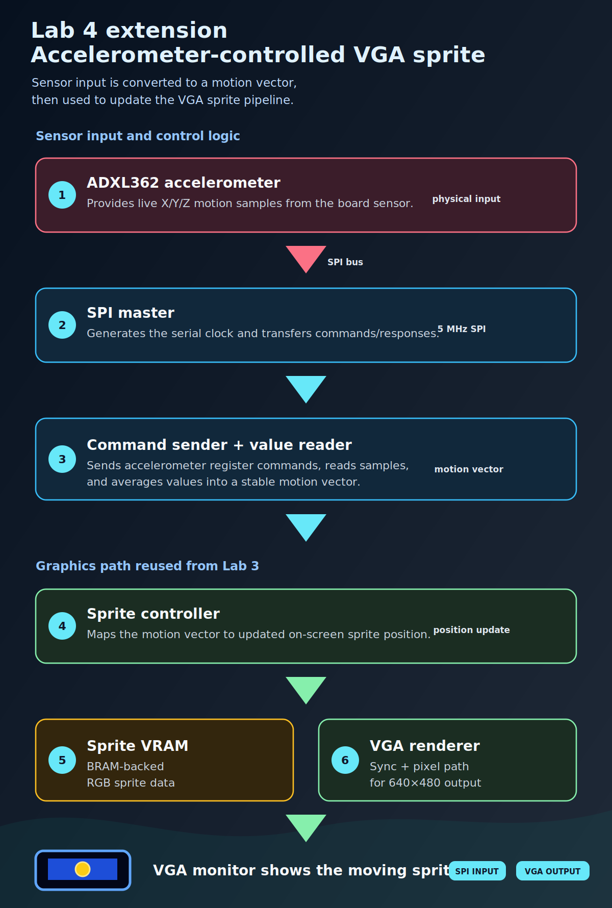

# ECE333 — Digital Systems Lab


Coursework repository for **ECE333 — Digital Systems Lab** at the **University of Thessaly**. The labs build FPGA digital systems in Verilog, starting with seven-segment display logic and moving through UART communication, VGA graphics, SPI accelerometer interfacing, and full-system integration on the Nexys A7 platform.

<p align="center">
  
</p>

## Standout work: accelerometer-controlled VGA sprite

- **Lab 3 optional VGA extension:** implemented the optional video-display requirements, including a VGA driver capable of rendering image data and animated sprites on the board.
- **Lab 4 custom accelerometer-controlled graphics extension:** went beyond the assignment requirements by connecting the Lab 4 SPI accelerometer pipeline back into the Lab 3 VGA/sprite system, using live accelerometer readings to move a sprite on screen.
- Built the supporting RTL around those demos: VGA timing, BRAM-backed pixel/sprite data, SPI command sequencing, accelerometer value reading, formatting logic, UART reporting, and display-oriented test units.
- Included block/dataflow/FSM diagrams throughout the labs so the architecture is easy to inspect alongside the Verilog implementation.

**Lab 4 custom extension demo — accelerometer-controlled VGA sprite**

https://github.com/user-attachments/assets/1549df07-594a-4e26-9d4d-d74dd1c7e6ee

## Lab contents

| Lab | Contents | Design documentation |
| --- | --- | --- |
| [`Lab1/`](Lab1/) | Seven-segment display systems: LED decoder, multiplexed four-digit display driver, debouncers, counters, and Nexys A7 constraints. | [`part_b/FourDigitLEDdriver`](Lab1/part_b/dataflow/FourDigitLEDdriver.drawio), [`part_c/FourDigitLEDdriver`](Lab1/part_c/dataflow/FourDigitLEDdriver.drawio), [`part_d/FourDigitLEDdriver`](Lab1/part_d/dataflow/FourDigitLEDdriver.drawio) |
| [`Lab2/`](Lab2/) | UART communication pipeline: baud-rate controller, transmitter, receiver, receiver error tests, message controller, and LED-display integration. | [`transmitter_fsm`](Lab2/part_b/diagrams/transmitter_fsm.drawio), [`transmitter_dataflow`](Lab2/part_b/diagrams/transmitter_dataflow.drawio), [`receiver_fsm`](Lab2/part_c/diagrams/receiver_fsm.drawio), [`receiver_dataflow`](Lab2/part_c/diagrams/receiver_dataflow.drawio), [`controller_dataflow`](Lab2/part_d/diagrams/controller_dataflow.drawio) |
| [`Lab3/`](Lab3/) | VGA graphics pipeline: generated VRAM image data, pixel controller, sync FSMs/controllers, static image output, and the optional sprite/video renderer. | [`VGA dataflow`](Lab3/diagrams/dataflow.drawio), [`gsync_fsm`](Lab3/diagrams/gsync_fsm.drawio) |
| [`Lab4/`](Lab4/) | SPI accelerometer system: SPI master/slave testing, command sender, value reader, binary-to-ASCII conversion, UART reporting, display test units, and the custom accelerometer-to-VGA sprite extension. | [`accelerometer_driver`](Lab4/diagrams/accelerometer_driver.drawio), [`spi_master_fsm`](Lab4/diagrams/spi_master_fsm.drawio), [`command_sender_fsm`](Lab4/diagrams/command_sender_fsm.drawio), [`value_reader_fsm`](Lab4/diagrams/value_reader_fsm.drawio), [`binary_to_ascii_fsm`](Lab4/diagrams/binary_to_ascii_fsm.drawio) |
| [`scripts/`](scripts/) | Repository helpers for lightweight HDL validation, lab inventory, and local output reset. | [`check_all.sh`](scripts/check_all.sh), [`list_assignments.sh`](scripts/list_assignments.sh), [`clean_all.sh`](scripts/clean_all.sh) |

### Lab 1 - Display drivers

Lab 1 introduces seven-segment display control on the Nexys A7. It starts with a basic LED decoder and expands into a multiplexed four-digit display driver with counters, input synchronization, debouncing, and board constraints. The design supports the lab's rotating 16-character message flow, first stepped by button input and then advanced automatically after a fixed delay.

### Lab 2 - UART pipeline

Lab 2 develops a serial communication stack in stages: baud-rate timing, transmission, reception, parity/framing error handling, message buffering, and an integrated UART-to-display controller. The report documents eight selectable baud rates, the 16x receiver sampling requirement, transmitter/receiver Moore FSMs, parity and framing error test cases, and the optional path that displays received UART messages on the seven-segment display.

<p align="center">
  
</p>

### Lab 3 - VGA graphics and sprite rendering

Lab 3 builds a VGA graphics path using generated VRAM data, pixel addressing, horizontal/vertical sync control, and image rendering logic. The design instantiates separate BRAM-backed VRAM modules for red, green, and blue, initializes them from Python-generated image data, and upscales 128x96 memory contents to 640x480 output through the sync/pixel-control pipeline. The optional part extends the base graphics pipeline into a sprite-capable display system, including a DVD-logo-style animation path that updates the sprite between frames instead of only showing static pixel output.

### Lab 4 - SPI accelerometer system and VGA extension

Lab 4 connects an SPI accelerometer data path to downstream formatting and output modules. It includes a double-dabble binary-to-BCD/ASCII converter, a 5 MHz SPI master driven from an MMCM-derived serial clock, SPI command/value-reader logic for the ADXL362 accelerometer, averaging support, UART transmission, and display test units.

The custom extension connects this accelerometer pipeline to the VGA/sprite work from Lab 3, turning live sensor readings into on-screen sprite movement. That makes the final design a cross-lab FPGA system: SPI input from the accelerometer drives graphics output through the reused VGA renderer.

<p align="center">
  
</p>

## Requirements

For lightweight validation:

- `make`
- `iverilog` from Icarus Verilog

For full FPGA project work:

- Xilinx Vivado
- Nexys A7 board support files/constraints
- Optional GTKWave or Vivado simulator for waveform inspection

## Quick validation

Run the representative HDL checks from the repository root:

```bash
make check
```

The checks elaborate selected testbenches for the LED decoder, UART blocks, Lab 4 formatting/averaging units, and a display decoder unit. Full VGA/display-driver elaboration is left to Vivado because those designs instantiate Xilinx primitives such as `MMCME2_BASE` and `RAMB18E1`.

Other useful commands:

```bash
make list   # print a compact lab inventory
make clean  # clear local simulator/Vivado outputs
```

## Full setup explanation

### Lightweight HDL checks

Install Icarus Verilog and run the root validation target:

```bash
sudo apt install iverilog
make check
```

This path is intended for quick inspection on a normal Linux machine. It verifies representative modules and testbenches without requiring the full Vivado simulator library stack.

### Vivado and board demos

Use the lab/part source directories as the design entry points. Each assignment keeps the Verilog modules, testbenches, and board constraints next to the relevant part, so the design can be inspected directly or imported into a Vivado project for synthesis/implementation.

For the full Nexys A7 demos:

1. Select the lab part you want to run, such as the Lab 3 VGA renderer or the Lab 4 accelerometer/VGA extension.
2. Add that part's Verilog sources and constraints to Vivado.
3. Generate the bitstream for the selected top-level design.
4. Program the Nexys A7.
5. For Lab 3, connect the VGA output to view the image/sprite renderer.
6. For Lab 4, connect the accelerometer/VGA setup to see live accelerometer movement drive the on-screen sprite.

The Lab 4 extension is the most complete system-level demo: sensor input enters through the SPI accelerometer path, is interpreted by the Verilog control logic, and is then used by the reused VGA renderer to move a sprite on screen.

